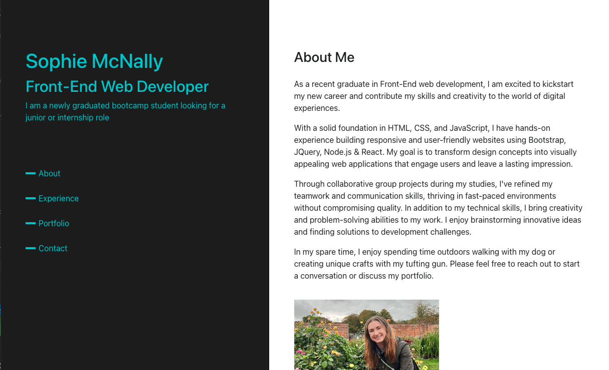

# React-Portfolio---Module-13-Challenge

## Description

This is a portfolio website built using React, showcasing the work and skills of Sophie McNally, a front-end web developer. The website serves as a digital resume, providing information about Sophie's background, education, experience, and projects.

## Features
Home Page: Introduces Sophie McNally and highlights her skills and expertise.
About Page: Provides a detailed overview of Sophie's background, education, and professional experience.
Experience Page: Showcases Sophie's work history, including education and relevant job experience.
Portfolio Page: Displays a selection of Sophie's portfolio projects, demonstrating her skills and expertise.
Contact Page: Provides a contact form and contact information for users to reach out to Sophie.
Responsive Design: The website is fully responsive, ensuring a seamless experience across different devices and screen sizes.

## Technologies Used
React: The website is built using the React JavaScript library, enabling efficient component-based development.
React Router: Implements routing functionality for navigating between different pages within the website.
React Bootstrap: Utilizes Bootstrap components to create a responsive and visually appealing user interface.
CSS: Custom CSS styles are applied to enhance the design and layout of the website.

## Installation
Clone the repository to your local machine.
Navigate to the project directory.
Run npm install to install the required dependencies.
Run npm start to start the development server.
Open the website in your web browser by visiting http://localhost:3000.

## Contribution
Contributions to the project are welcome. If you find any issues or have suggestions for improvements, feel free to open an issue or submit a pull request.

## Questions

GitHub profile: https://github.com/SophieEmsi

If you have any questions, please contact me at sophie@sophie.com.

